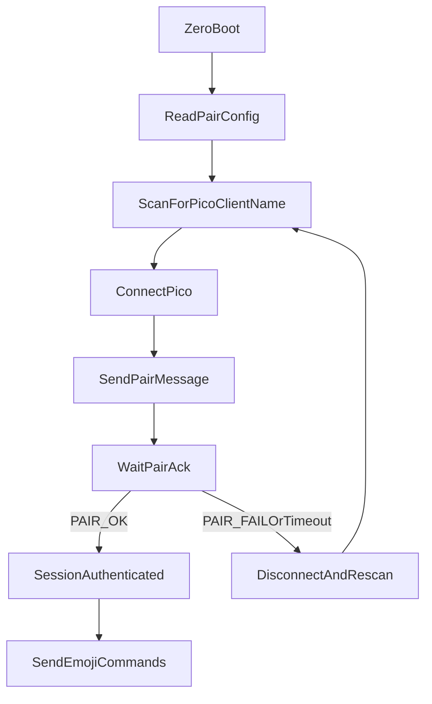

# Multiplayer Mode

The current state of this project is fixed for only one controller script running on one Raspberry Pi Zero and one emoji badge running on one Raspberry Pi Pico 2 W.

The two scripts are:

- `python\emoji-os\emoji-os-pico-0.2.4.py`
- `python\emoji-os\emoji-os-zero.py`

We want to be able to have multiple controllers and multiple emoji badges.  There are two scenarios that we want to support:

1. One controller and one emoji badge.
2. One controller and multiple emoji badges.

First, lets implement the first scenario.

## One controller and one emoji badge

When I setup a controller and badge, I would like to choose the name that the controller and badge will use to pair with each other.

## Implementation: exclusive pairing via `PAIR_NAME`

Each controller/badge pair is identified by a user-chosen string called `PAIR_NAME`.
Both devices in a pair must be configured with the exact same `PAIR_NAME`. Devices
with different `PAIR_NAME` values will not connect to each other, so multiple
pairs can coexist in the same Bluetooth range without interfering.

`PAIR_NAME` is shipped as a tiny per-device config file (`pair_config.py`) sitting
next to each script. Both scripts try to `import pair_config` at startup; if the
file is missing the value falls back to `"default"`, so out-of-the-box behaviour
is preserved for a single pair.

### Configuration

- File location (Zero, preferred): one directory **above** the cloned repo,
  e.g. `/home/tim/repos/pair_config.py` when the repo lives at
  `/home/tim/repos/rainbow-connection/`. Keeping the file outside the repo
  means `git pull` will not overwrite it.
- File location (Zero, fallback): `python/emoji-os/pair_config.py` next to
  `emoji-os-zero.py`. The Zero will use this if no external file is found.
- File location (Pico): `pair_config.py` on the Pico's filesystem (alongside
  `emoji-os-pico-*.py`). The Pico is updated by manually copying files, so the
  config can live next to the script without being clobbered by updates.
- File contents (all locations):

```python
PAIR_NAME = "living-room"
```

The string can be anything you like (recommended: lowercase, no spaces, e.g.
`living-room`, `kitchen`, `alpha`). Both halves of a pair must match exactly.

The Zero logs which file it loaded `PAIR_NAME` from at startup, e.g.

```text
[PAIR] PAIR_NAME='living-room' (loaded from /home/tim/repos/pair_config.py) — looking for 'Pico-Client-living-room'
```

### Wire protocol

The pairing layer reuses the existing Nordic UART Service. Two changes are made:

1. The Pico's advertised BLE name now includes `PAIR_NAME`:

   ```text
   Pico-Client-<PAIR_NAME>
   ```

   So a badge with `PAIR_NAME = "living-room"` advertises as
   `Pico-Client-living-room`. The Zero only targets that exact name.

2. After BLE connect, the Zero performs an application-layer handshake before
   any other command is processed:

   ```text
   Zero -> Pico  (write to UART RX):    PAIR:<PAIR_NAME>
   Pico -> Zero  (notify on UART TX):   PAIR_OK   or   PAIR_FAIL
   ```

   - The Pico drops/ignores every other command until it has seen a matching
     `PAIR:` message on that connection.
   - The Zero only marks itself "connected" and starts sending emoji commands
     after it receives `PAIR_OK` within a short timeout. On `PAIR_FAIL` or
     timeout it disconnects and rescans.

Auth state is tracked per BLE connection on the Pico and cleared on disconnect,
so a fresh handshake is required after any reconnect.

### Connection flow



### Behaviour summary

- Wrong `PAIR_NAME`: Zero never selects the badge during scan (different
  advertised name); even if forced, the badge replies `PAIR_FAIL` and the Zero
  disconnects.
- Matching `PAIR_NAME`: full connectivity restored on reconnect / power cycle
  without manual steps.
- Multiple pairs in the same room: each Zero scans for its specific
  `Pico-Client-<PAIR_NAME>` name, so they connect only to their partner badge.
- Legacy single-pair setup: leaving `pair_config.py` off both devices uses
  `PAIR_NAME = "default"` on each, which still pairs correctly.

### Advertising packet layout

A 128-bit UART service UUID plus a `Pico-Client-<PAIR_NAME>` name will not fit
in a single 31-byte BLE advertising packet. To keep both visible to the Zero,
the Pico splits its advertising:

- **Adv data**: flags + Nordic UART service UUID (lets service-UUID-filtered
  scans still match the badge).
- **Scan response**: complete local name only (so the Zero's active scan can
  see the full `Pico-Client-<PAIR_NAME>` string and pick the correct badge in
  multi-pair environments).

The Pico also calls `bluetooth.BLE().config(gap_name=...)` so the same name is
exposed through the GAP service after connect, instead of the firmware default
`MPY BTSTACK`.

### Affected scripts

- `python/emoji-os/emoji-os-pico-0.2.4.py` (now `VERSION = "0.3.1"`)
- `python/emoji-os/emoji-os-zero.py` (now `VERSION = " v0.5.2"`)

---

## Real-Time Game Modes

When a game is running, the Zero and Pico display different states driven by
WebSocket events from the server. This section is the authoritative reference
for what each device shows in every game state.

### Server game lifecycle

The server tracks a game through these states:

| State | Meaning |
| --- | --- |
| `draft` | Game created; setup on the webapp (questions, etc.) |
| `ready` | Referee opened the game detail page; controllers show standby `G` |
| `lobby` | Open for joining; badges can join |
| `active` | Game is live; questions can be opened |
| `paused` | Game temporarily paused |
| `completed` | Game finished normally |
| `cancelled` | Game cancelled before completion |

### Zero LCD (game mode active)

When the player has entered game mode (menu 3 / pos 4 on the Zero), the LCD
shows the same Platform icon glyph as the Pico (full-screen). Optional text
overlays only when an action is required:

| Server state | Joined? | Question phase | Zero LCD glyph | Overlay |
| --- | --- | --- | --- | --- |
| *(none / ready)* | — | — | Capital `G` (`mode`) | — |
| `lobby` | No | — | Yellow 4×4 | `JOIN? KEY1` |
| `lobby` | Yes | — | White 4×4 outline | — |
| `active` | — | none | Green 4×4 | — |
| `active` | — | open | `?` | — |
| `active` | — | closed | White 2×2 | — |
| `completed` | — | — | Winner / loser / ended | `GAME OVER` only if unenriched |

Pressing **KEY1** (positive) while in `lobby` (not yet joined) POSTs join to
the server. **KEY2** exits game mode to menu select (it does not join). From
there KEY1/KEY3 scroll options and KEY2 confirms an emoji as usual (full-screen
on Zero; Pico too unless a question is open). Re-entering game mode
(Others → pos 4) refreshes the Zero LCD from the server snapshot.

**Important:** `GAME:*` BLE commands (especially `GAME:question_open`) are
always sent to the Pico while connected — the badge must arm NFC for card
scans even if the Zero LCD is browsing emojis. While a question is open,
emoji BLE writes are skipped so the Pico stays on `?` / scan-ready.

### WebSocket events and Zero behaviour

The Zero's `_ws_handle_event` function processes these server-to-controller
events and relays the appropriate `GAME:*` BLE command to the Pico:

| WS event | Zero action | BLE command sent to Pico |
| --- | --- | --- |
| `controller.welcome` | Lightweight ack only (no game fields). Zero then `GET /api/pairs/:pairName` and applies that as a rich welcome | From pair snapshot: `GAME:mode` / `lobby` / `lobby_joined` / `active` / … |
| `game.opened` | Set state → `lobby`; show `JOIN? KEY1` | `GAME:lobby` |
| `game.started` | Set state → `active`; show green active | `GAME:active` |
| `question.opened` | Save `questionId`; show `?` | `GAME:question_open` |
| `question.closed` | Clear `questionId`; show white 2×2 | `GAME:question_close` |
| `game.ended` | Set state → `completed` | `GAME:ended` (or winner/loser) |
| `question.result` | Look up own pair in results (skip if already answered on scan) | `GAME:correct` or `GAME:wrong` |
| `game.ended` enriched | Check `isWinner` flag | `GAME:winner` or `GAME:loser` |

### Pico matrix display (GAME:\* BLE commands)

The Zero sends `GAME:<subcommand>` over BLE; the Pico renders the matching
pattern on its 8×8 LED matrix:

| BLE command | Pico `_game_state` | Matrix display | Duration |
| --- | --- | --- | --- |
| `GAME:mode` | `"mode"` | Capital white `G` (game-mode standby) | Until next command |
| `GAME:lobby` | `"lobby"` | Solid yellow 4×4 centre | Until next command |
| `GAME:lobby_joined` | `"lobby_joined"` | White 4×4 outline | Until next command |
| `GAME:active` | `"active"` | Solid green 4×4 centre square | Until next command |
| `GAME:question_open` | `"question_open"` | Question mark glyph; NFC polling starts | Until card scan or next command |
| `GAME:question_close` | `"question_close"` | Small white 2×2 centre dot | Until next command |
| `GAME:ended` | `"ended"` | Scrolls `DONE` then goes dark | One-shot then off |
| `GAME:correct` | `"correct"` | Blue filled circle | Until `question_close` / next |
| `GAME:wrong` | `"wrong"` | Red X | Until `question_close` / next |
| `GAME:winner` | `"winner"` | Fireworks animation | Until next / idle |
| `GAME:loser` | `"loser"` | Rain animation | Until next / idle |

### NFC card scan flow

This is the full path from physical card tap to server guess, for a single
question answer:

```
1. Referee opens a question → server emits question.opened
2. Zero receives question.opened → sends GAME:question_open to Pico
3. Pico enters question_open state → NFC polling starts; shows ?

4. Player taps NFC card on badge
5. Pico reads card UID → sends TAG:<cardUid> over BLE to Zero
6. Pico shows brief green circle (5 s) then reverts to ? (duplicate-send guard)

7. Zero receives TAG: notification
8. Zero looks up UID in NFC_CARD_MAP → resolves slotLabel (A/B/C/D/E)
9. Zero POSTs { gameId, questionId, pairName, cardUid, slotLabel } to /api/guesses
10. Server records guess

--- question remains open for other pairs to answer ---

11. Referee closes the question → server emits question.closed
12. Zero receives question.closed → sends GAME:question_close to Pico
13. Pico shows white 2×2 dot

--- Step 8 (planned) ---
14. Server emits question.result with per-pair correct/wrong outcome
15. Zero receives question.result → looks up own pairName in results
16. If correct  → Zero sends GAME:correct to Pico (bright flash ~4 s)
17. If wrong    → Zero sends GAME:wrong to Pico (dim blink ~4 s)
18. After ~4 s  → Pico automatically reverts to white 2×2 dot
```

### Demo NFC card → answer slot map

| Physical card | Tag UID | Answer slot | Typical use |
| --- | --- | --- | --- |
| R12 Monkey | `5B:6F:B8:08` | **A** | Correct when the question’s correct option is A (e.g. “A Monkey”) → blue circle |
| W3 Clown | `DB:93:B7:08` | **B** | Wrong when A is correct → red X |

Any other / unknown UID is treated as **wrong** (red X). The same map lives in
`NfcCardService` (server seed), Demo Set assign, Zero `NFC_CARD_MAP`, and
`pair_config.py` `NFC_CARD_MAP_LOCAL`.

### Scan feedback on the Pico

| Stage | Behaviour |
| --- | --- |
| Card tap registered | Green 4×4 outline; Zero then sends correct/wrong |
| Correct answer revealed | Blue filled circle (immediate after guess POST) |
| Wrong answer revealed | Red X (immediate after guess POST) |
| Game winner at end | Fireworks |
| Game loser at end | Rain |

Correct/wrong feedback fires **immediately on card scan** once the guess
response returns `isCorrect`. `question.result` on close updates the
dashboard; devices that already answered skip a second animation.

---

## Start and join a game (referee → Zero → Pico)

End-to-end checklist for opening a lobby in the emoji-app **Referee Controls**
panel and joining from the Zero so both Zero and Pico show the lobby states.

### Prerequisites

1. **Matching `PAIR_NAME`** — Zero and Pico both load the same `PAIR_NAME`
   from `pair_config.py` (see [Configuration](#configuration)). The referee
   **Bound pairs** entry must use that exact string. If the Zero logs
   `PAIR_NAME='white'` but the UI shows `power-cable`, re-bind as `white`
   (or change the device config and restart). Join and WS rooms are keyed by
   this name; a mismatch means the controller never receives `game.opened`
   and KEY1 join does nothing useful.
2. **BLE link up** — Zero connected to `Pico-Client-<PAIR_NAME>` (Badges UI
   shows connected). Sync a normal emoji first (menu 0 / pos 1) to confirm
   the pipe works.
3. **WebSocket** — Zero connected to the emoji-app server (`[WS] connected`
   in the Zero log). After hello it polls `GET /api/pairs/<PAIR_NAME>`.
4. **Versions** — Controller ≈ `0.7.5`, Pico ≈ `0.5.2` (see server
   `EXPECTED_*_VERSION`).

### Referee (emoji-app Game → Referee Controls)

| Step | UI action | Server effect |
| --- | --- | --- |
| 1 | Open the game detail page | Game may be `completed` / `ready` / `lobby` |
| 2 | If completed/cancelled: **Play Again** / **Restart** | State → `ready` (controllers get `game.ready` → standby `G`); pairs stay bound but `joined` resets |
| 3 | **Bind** the controller’s `PAIR_NAME` (chip or typed name) | `POST /api/games/:id/pairs` — pair appears under Bound pairs as `not joined` |
| 4 | Assign NFC card group if needed (**Reassign demo group**) | Cards available for later questions |
| 5 | **Open for Joining** | State → `lobby`; WS `game.opened` to that pair’s room; dashboard shows Lobby |

Do **not** press **Start Game** until the Bound pairs row shows `joined`.

### Zero + Pico display sequence

| Step | Operator action | Zero LCD | Pico matrix | Notes |
| --- | --- | --- | --- | --- |
| A | Menu **Others** → pos **4** (game) / confirm | Capital **G** (`mode`) | Capital **G** (`GAME:mode`) | Entering game mode always BLE-syncs Pico — even with no lobby yet |
| B | After referee **Open for Joining** | Yellow 4×4 + `JOIN? KEY1` (`lobby`) | Yellow 4×4 (`GAME:lobby`) | From `game.opened` or pair-binding poll |
| C | Press **KEY1** (pos) to join | White 4×4 outline (`lobby_joined`) | White 4×4 outline (`GAME:lobby_joined`) | `POST /api/games/:id/join`; UI Bound pairs → `joined` |
| D | Referee **Start Game** | Green then `?` (`question_open`) | Green then `?` (`GAME:question_open`) | Server auto-opens the next closed question so NFC arms immediately |
| E | Player taps NFC card | Correct/wrong glyph | Correct/wrong glyph | Pico sends `TAG:`; Zero POSTs guess |

### What usually goes wrong

| Symptom | Likely cause |
| --- | --- |
| Pico keeps the last emoji after Zero enters game mode | Old Pico firmware without `GAME:mode`, or BLE not connected when entering game mode |
| Yellow lobby never appears after Open for Joining | `PAIR_NAME` ≠ bound pair name, or Zero WS disconnected (missed `game.opened` and poll 404) |
| KEY1 does nothing; UI stays `not joined` | `_join_pending` false — no lobby snapshot yet (fix pair name / WS / binding) |
| Bound pair shows wrong name | Re-bind using the name printed in Zero’s `[PAIR]` startup line |

### Suggested smoke test order

1. Start Pico → Zero → emoji-app.
2. Sync menu 0 / pos 1 (normal emoji) — Pico shows the emoji.
3. Enter game mode on Zero — both show **G**.
4. In referee: bind the Zero’s `PAIR_NAME`, **Play Again** if needed, **Open for Joining**.
5. Both devices switch to yellow lobby; press KEY1 — both show white outline; UI shows `joined`.
6. **Start Game** — both briefly show green active, then `?` (question auto-opens); tap an NFC card.

---

## Platform icon / display reference

The table below maps every game event or state to its intended visual on each
of the three platforms. Step 8 rows (correct/wrong/winner/loser) are implemented.

| Event / state | State id | Pico badge (8×8 LED matrix) | Zero game controller (LCD) | Emoji-app (Lucide icon) |
| --- | --- | --- | --- | --- |
| **Game mode standby** | `mode` | Capital white `G` | Capital white `G` | *(n/a — referee uses game lifecycle)* |
| **Lobby — not yet joined** | `lobby` | Solid yellow 4×4 centre square | Solid yellow 4×4 centre square | `door-open` |
| **Lobby — joined, waiting** | `lobby_joined` | White 4×4 outline square (1 px border, black interior) | White 4×4 outline square (1 px border, black interior) | `hand-platter` |
| **Game started / active** | `active` | Solid green 4×4 centre square | Solid green 4×4 centre square | `turntable` |
| **Question open** | `question_open` | Question mark `?` glyph; NFC polling active | Question mark `?` glyph | `message-circle-question-mark` |
| **Card scanned** (tap acknowledged) | `card_scanned` | Green 4×4 outline square (1 px border); Zero then sends correct/wrong command immediately | Blue circle outline (correct) or red X (wrong) — Zero knows answer from `NFC_CARD_MAP` | Blue `circle` or red `x` (correct/wrong) |
| **Correct answer** | `correct` | Blue filled circle | Blue filled circle | `circle` (blue) |
| **Wrong answer** | `wrong` | Red X | Red X | `x` (red) |
| **Question closed** | `question_closed` | Small white 2×2 centre dot | Small white 2×2 centre dot | `book-alert` |
| **Game ended** | `game_ended` | Scrolls `DONE`, then goes dark | Text: `GAME OVER` (red) | `sparkles` |
| **Game winner** | `winner` | Fireworks animation (animations menu — positive 1) | Fireworks animation (animations menu — positive 1) | `podium` *(app uses `Trophy` until Lucide ships `Podium`)* |
| **Game loser** | `loser` | Rain animation (animations menu) | Rain animation (animations menu) | `eye-closed` |

### Shared game-state logging

All three runtimes (Pico, Zero, React) emit the same narrative line when a
Platform icon state is reached. Grep / merge the three consoles to read the
game as a single story.

**Format** (one line per state transition):

```text
[GAME] <platform> | <state_id> | <Event / state label> | <optional detail>
```

| Field | Values |
| --- | --- |
| `platform` | `pico` · `zero` · `react` |
| `state_id` | Exact id from the **State id** column above |
| label | Exact **Event / state** text from the table (without markdown bold) |
| detail | Short platform-specific note (BLE command, icon name, pair, card UID, …) |

**Examples** (interleaved from three devices during one question):

```text
[GAME] zero | question_open | Question open | WS question.opened; BLE→GAME:question_open
[GAME] pico | question_open | Question open | ? glyph; NFC on
[GAME] react | question_open | Question open | icon=message-circle-question-mark
[GAME] pico | card_scanned | Card scanned | TAG:5B:6F:B8:08; green 4×4 outline
[GAME] zero | card_scanned | Card scanned | TAG→POST /api/guesses slotLabel=A
[GAME] zero | correct | Correct answer | guess isCorrect=true; BLE→GAME:correct
[GAME] pico | correct | Correct answer | blue filled circle
[GAME] react | correct | Correct answer | icon=circle pair=green slot=A
[GAME] zero | question_closed | Question closed | WS question.closed; BLE→GAME:question_close
[GAME] pico | question_closed | Question closed | white 2×2 dot
[GAME] react | question_closed | Question closed | icon=book-alert
```

Rules:

- Log **when the state is reached on that platform** (display shown, icon
  updated, or BLE command sent) — not only when the WS event arrives.
- Use the table **label** verbatim so logs match the design doc.
- Keep `[GAME]` as the prefix so non-game logs (`[WS]`, `[BLE]`, `[NFC]`)
  stay separate; those may remain for transport debugging.
- BLE command names may differ slightly from `state_id`
  (`GAME:question_close` → log `question_closed`; `GAME:ended` → log
  `game_ended`). Always log the **state id**, and put the wire command in
  the detail field.

### Card scan → immediate correct/wrong flow

When a player taps an NFC card during an open question, the Zero already has
the full `NFC_CARD_MAP` (with `slotLabel` for each card UID). It can therefore
resolve the answer immediately without waiting for the question to close:

```
1. Pico: card tapped → shows green 4×4 outline square (tap acknowledged)
2. Pico: sends TAG:<cardUid> to Zero over BLE
3. Zero: looks up cardUid in NFC_CARD_MAP → gets slotLabel
4. Zero: POSTs guess to /api/guesses (response confirms correctness)
5. Zero: shows blue circle (correct) or red X (wrong) on its own LCD
6. Zero: sends GAME:correct or GAME:wrong to Pico over BLE
7. Pico: shows blue filled circle (correct) or red X (wrong)
8. Emoji-app: receives nfc.tagged WS event → shows blue circle or red X
```

The Zero needs to know the correct answer at step 4. Options:
- The `POST /api/guesses` response can return `{ isCorrect: boolean }`.
- Alternatively, `question.opened` can carry the correct `slotLabel` so
  the Zero resolves it locally without a round-trip.

### Notes

- **Pico** displays are driven by `GAME:*` BLE commands from the Zero. The
  green 4×4 outline square is the generic tap-acknowledgment; the blue circle
  or red X follows immediately once the Zero resolves the answer.
- **Zero LCD** lobby squares mirror the Pico so both devices show the same
  state at a glance. The `?` glyph replaces the text `SCAN NOW` label so all
  three platforms share the same question-open symbol.
- **Emoji-app** icons are all from [Lucide](https://lucide.dev/icons/).
  Colour variants (blue `circle`, red `x`) are applied via Tailwind classes;
  the icon name itself is colour-neutral.
- **Fireworks / rain animations** already exist in the Zero and Pico animation
  libraries (accessible from the main menu). They are reused here as the
  winner/loser end-state displays, so no new animations need to be authored.
