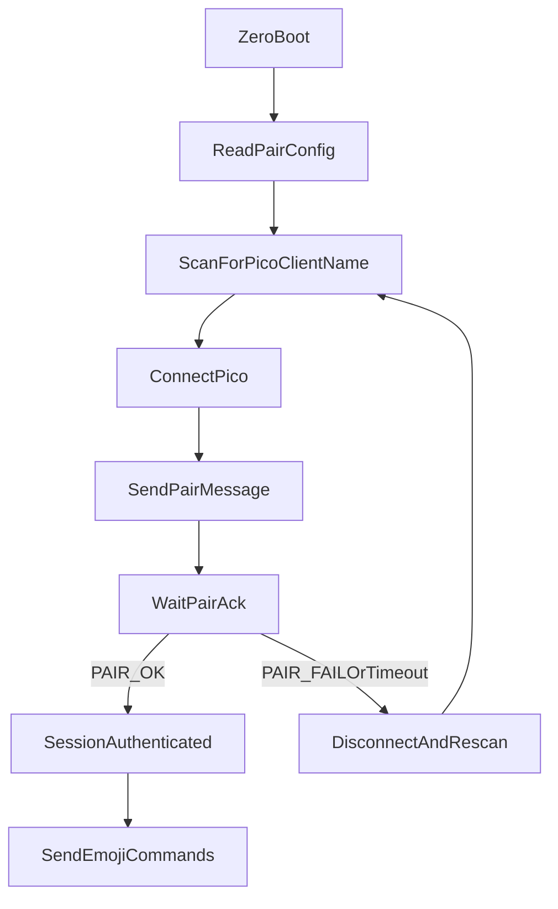

# Multiplayer Mode

The current state of this project is fixed for only one controller script running on one Raspberry Pi Zero and one emoji badge running on one Raspberry Pi Pico 2 W.

The two scripts are:

- `python\emoji-os\emoji-os-pico-0.2.4.py`
- `python\emoji-os\emoji-os-zero.py`

We want to be able to have multiple controllers and multiple emoji badges.  There are two scenarios that we want to support:

1. One controller and one emoji badge.
2. One controller and multiple emoji badges.

First, lets implement the first scenario.

## One controller and one emoji badge

When I setup a controller and badge, I would like to choose the name that the controller and badge will use to pair with each other.

## Implementation: exclusive pairing via `PAIR_NAME`

Each controller/badge pair is identified by a user-chosen string called `PAIR_NAME`.
Both devices in a pair must be configured with the exact same `PAIR_NAME`. Devices
with different `PAIR_NAME` values will not connect to each other, so multiple
pairs can coexist in the same Bluetooth range without interfering.

`PAIR_NAME` is shipped as a tiny per-device config file (`pair_config.py`) sitting
next to each script. Both scripts try to `import pair_config` at startup; if the
file is missing the value falls back to `"default"`, so out-of-the-box behaviour
is preserved for a single pair.

### Configuration

- File location (Zero): `python/emoji-os/pair_config.py`
- File location (Pico): `pair_config.py` on the Pico's filesystem (alongside `emoji-os-pico-*.py`)
- File contents (both devices):

```python
PAIR_NAME = "living-room"
```

The string can be anything you like (recommended: lowercase, no spaces, e.g.
`living-room`, `kitchen`, `alpha`). Both halves of a pair must match exactly.

### Wire protocol

The pairing layer reuses the existing Nordic UART Service. Two changes are made:

1. The Pico's advertised BLE name now includes `PAIR_NAME`:

   ```text
   Pico-Client-<PAIR_NAME>
   ```

   So a badge with `PAIR_NAME = "living-room"` advertises as
   `Pico-Client-living-room`. The Zero only targets that exact name.

2. After BLE connect, the Zero performs an application-layer handshake before
   any other command is processed:

   ```text
   Zero -> Pico  (write to UART RX):    PAIR:<PAIR_NAME>
   Pico -> Zero  (notify on UART TX):   PAIR_OK   or   PAIR_FAIL
   ```

   - The Pico drops/ignores every other command until it has seen a matching
     `PAIR:` message on that connection.
   - The Zero only marks itself "connected" and starts sending emoji commands
     after it receives `PAIR_OK` within a short timeout. On `PAIR_FAIL` or
     timeout it disconnects and rescans.

Auth state is tracked per BLE connection on the Pico and cleared on disconnect,
so a fresh handshake is required after any reconnect.

### Connection flow



### Behaviour summary

- Wrong `PAIR_NAME`: Zero never selects the badge during scan (different
  advertised name); even if forced, the badge replies `PAIR_FAIL` and the Zero
  disconnects.
- Matching `PAIR_NAME`: full connectivity restored on reconnect / power cycle
  without manual steps.
- Multiple pairs in the same room: each Zero scans for its specific
  `Pico-Client-<PAIR_NAME>` name, so they connect only to their partner badge.
- Legacy single-pair setup: leaving `pair_config.py` off both devices uses
  `PAIR_NAME = "default"` on each, which still pairs correctly.

### Advertising packet layout

A 128-bit UART service UUID plus a `Pico-Client-<PAIR_NAME>` name will not fit
in a single 31-byte BLE advertising packet. To keep both visible to the Zero,
the Pico splits its advertising:

- **Adv data**: flags + Nordic UART service UUID (lets service-UUID-filtered
  scans still match the badge).
- **Scan response**: complete local name only (so the Zero's active scan can
  see the full `Pico-Client-<PAIR_NAME>` string and pick the correct badge in
  multi-pair environments).

The Pico also calls `bluetooth.BLE().config(gap_name=...)` so the same name is
exposed through the GAP service after connect, instead of the firmware default
`MPY BTSTACK`.

### Affected scripts

- `python/emoji-os/emoji-os-pico-0.2.4.py` (now `VERSION = "0.3.1"`)
- `python/emoji-os/emoji-os-zero.py` (now `VERSION = " v0.5.1"`)
